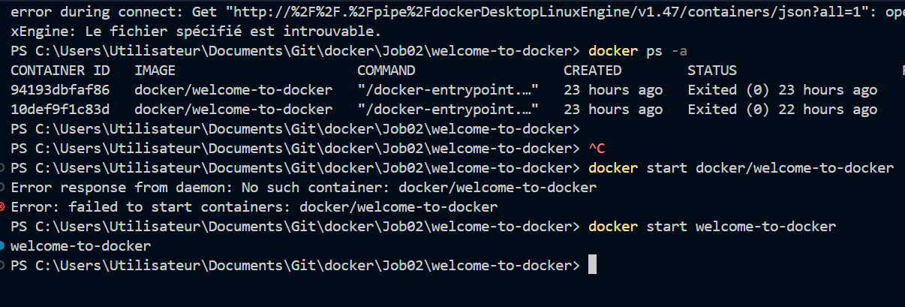
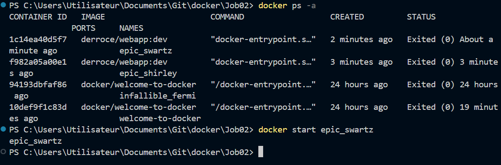

# Bienvenue dans mon projet Docker

### 1. Créer l'image Docker

## Pré-requis
- Docker installé sur votre machine
- Visual Studio Code avec le terminal intégré
- Un compte Docker Hub
- Un compte GitHub

---

## Étapes du projet

### 1. Préparation et analyse du projet
1. Ouvrir le terminal de **Visual Studio Code**
2. Se positionner dans le dossier du projet :
   ```sh
   cd welcome-to-docker
   ```
3. Lister les fichiers présents :
   ```sh
   ls -la  # sous Linux/macOS
   dir     # sous Windows
   ```
4. Analyser le fichier `Dockerfile` et comprendre son fonctionnement
5. Lire et comprendre le fichier `README.md` existant

### 2. Création de l'image Docker
1. Construire l'image Docker à partir du `Dockerfile` :
   ```sh
   docker build -t mon-image .
   ```
2. Vérifier que l'image a été créée :
   ```sh
   docker images
   ```

### 3. Lancer un conteneur Docker
1. Démarrer un conteneur à partir de l'image :
   ```sh
   docker run -d -p 3000:3000 --name mon-conteneur mon-image
   ```
2. Vérifier que le conteneur est en cours d'exécution :
   ```sh
   docker ps
   ```
3. Accéder au conteneur :
   ```sh
   docker exec -it mon-conteneur bash
   ```
4. Vérifier les fichiers à l'intérieur du conteneur

### 4. Modification du projet et mise à jour du conteneur
1. Retourner dans **Visual Studio Code** et modifier des fichiers du projet
2. Recréer l'image Docker pour intégrer les modifications :
   ```sh
   docker build -t mon-image .
   ```
3. Relancer un nouveau conteneur basé sur la nouvelle image
4. Vérifier que les modifications sont bien prises en compte

### 5. Publication sur Docker Hub
1. Se connecter à Docker Hub :
   ```sh
   docker login
   ```
2. Taguer l'image pour Docker Hub :
   ```sh
   docker tag mon-image mon-dockerhub/mon-image:latest
   ```
3. Pousser l'image vers Docker Hub :
   ```sh
   docker push mon-dockerhub/mon-image:latest
   ```
4. Partager l'image avec un membre de la promo

### 6. Récupération et modification d'une image d'un membre
1. Télécharger l'image d'un membre :
   ```sh
   docker pull dockerhub-user/image-partagee
   ```
2. Lancer un conteneur basé sur cette image et tester son fonctionnement
3. Effectuer des modifications et recréer une nouvelle image
4. Pousser l'image modifiée sur Docker Hub en citant l'auteur original dans ce README
- **Arthur**
---

## Captures d'écran
Les images sont stockées dans le dossier `images/` et illustrent les différentes étapes du projet.

### Étape 1

*Figure 1: Première étape du projet Docker*

### Étape 2

*Figure 2: Deuxième étape du projet Docker*

### Étape 3

*Figure 3: Troisième étape du projet Docker*

### Étape 4

*Figure 4: Quatrième étape du projet Docker*

### Étape 5

*Figure 5: Cinquième étape du projet Docker*

---

## Bonnes pratiques GitHub
- Effectuer des commits réguliers avec des messages clairs et explicites :
  ```sh
  git commit -m "Ajout du Dockerfile et première image Docker"
  ```
- Utiliser des noms de branches pertinents :
  ```sh
  git checkout -b feature-docker-setup
  ```
- Pousser les modifications régulièrement :
  ```sh
  git push origin feature-docker-setup
  ```

## Collaboration
- Documenter les contributions dans le README
- Mentionner l'auteur original des images Docker récupérées

Auteur de l'image originale : **Antony**

---

## Ressources utiles
- [Documentation officielle de Docker](https://docs.docker.com/)
- [Docker Hub](https://hub.docker.com/)
- [Tutoriel Docker pour les débutants](https://www.digitalocean.com/community/tutorial_series/getting-started-with-docker)

