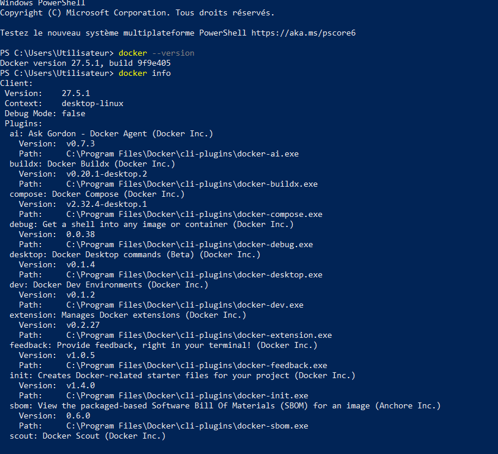
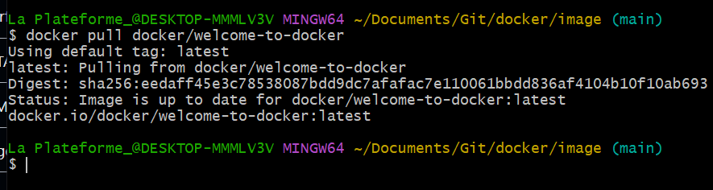
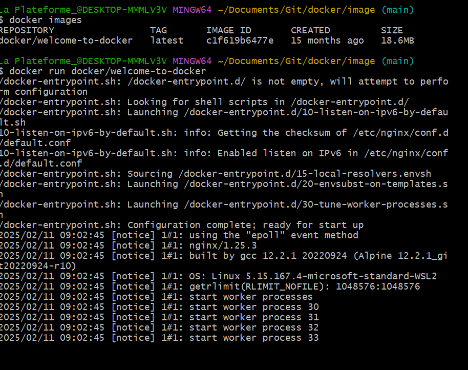
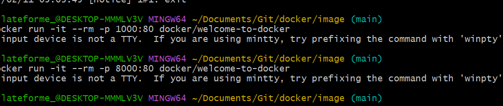

👩‍💻 Voir la version actuelle de docker ainsi que les infos du client

👩‍💻 Voir les conteneurs en cours d'exécution

👩‍💻 Voir les images en cours d'exécution

👩‍💻 Voir les conteneurs arrêtés

👩‍💻 Voir les images inutilisées
  

🚀 Guide de Suppression des Conteneurs et Images Docker

Ce guide explique comment supprimer des conteneurs et des images Docker avec des commandes simples et efficaces.
📦 Suppression des Conteneurs
🗑️ 1. Supprimer un conteneur spécifique

Supprimer mon_conteneur par l'ID ou le nom du conteneur à supprimer.

    📝 docker rm mon_conteneur

🗑️ 2. Supprimer plusieurs conteneurs

    📝 docker rm conteneur1 conteneur2 conteneur3

🗑️ 3. Supprimer tous les conteneurs arrêtés

    🚨 docker container prune -f

🛑 4. Forcer la suppression d'un conteneur actif

    ⚠️ docker rm -f mon_conteneur

🖼️ Suppression des Images

🗑️ 5. Supprimer une image spécifique

    📝 docker rmi mon_image

🗑️ 6. Supprimer plusieurs images

    📝 docker rmi image1 image2 image3

🗑️ 7. Supprimer toutes les images inutilisées

    🛑 docker image prune -f

🗑️ 8. Supprimer toutes les images non utilisées par un conteneur

    ⚠️ docker image prune -a -f

🛑 9. Forcer la suppression d'une image spécifique

    📝 docker rmi -f mon_image

🎯 Conclusion

Ce guide vous permet de nettoyer efficacement votre environnement Docker en supprimant conteneurs et images inutiles