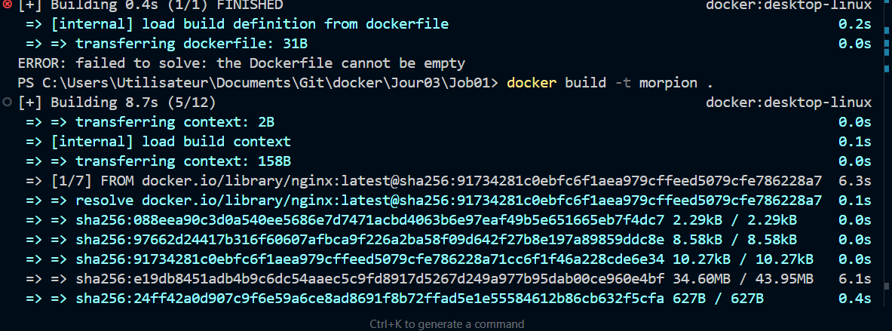
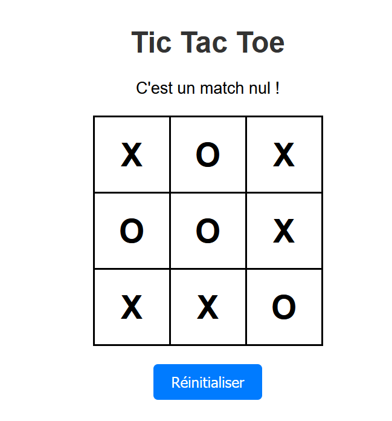

# 🎮 Projet Tic Tac Toe Docker

## 📸 Captures d'écran
### Interface du jeu


### Résultats des parties


## 📁 Structure du Projet
```
├── Dockerfile
├── index.html
├── save.php
├── results.json
└── nginx.conf
```

## 🚀 Instructions de déploiement

### 1. Création du volume
```bash
docker volume create game-results
```

### 2. Construction de l'image
```bash
docker build -t tictactoe-game .
```

### 3. Lancement du conteneur
```bash
docker run -d -p 8080:80 -v game-results:/usr/share/nginx/html/game-data --name tictactoe tictactoe-game
```

## 🔍 Commandes utiles

### Vérifier le volume
```bash
# Liste des volumes
docker volume ls

# Inspection du volume
docker volume inspect game-results
```

### Afficher le contenu du conteneur
```bash
# Liste des fichiers
docker exec tictactoe ls /usr/share/nginx/html

# Contenu du results.json
docker exec tictactoe cat /usr/share/nginx/html/game-data/results.json
```

### Afficher le contenu du volume
```bash
# Chemin du volume
docker volume inspect game-results -f '{{ .Mountpoint }}'

# Contenu du volume
sudo ls /var/lib/docker/volumes/game-results/_data
```

## 🎯 Points de vérification
- [ ] Le jeu est accessible sur http://localhost:8080
- [ ] Les résultats sont sauvegardés dans results.json
- [ ] Le volume est correctement monté
- [ ] PHP-FPM fonctionne avec Nginx

## 🛑 Arrêt du conteneur
```bash
docker stop tictactoe
```

## 📝 Notes importantes
- Le volume persiste même après l'arrêt du conteneur
- Les résultats sont stockés dans le volume game-results
- Nginx sert les fichiers statiques et PHP-FPM gère les scripts PHP


