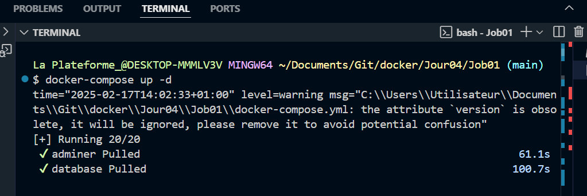
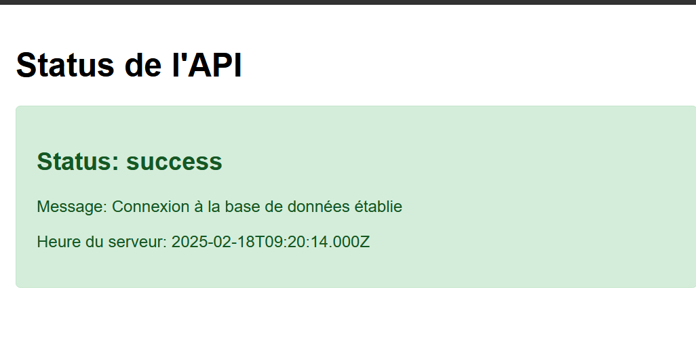

# Docker Compose - Application Multi-Services

## 📸 Captures d'écran
### Interface de l'application


### Résultats de la connexion à la base de données


## 🚀 Services

### Base de données (MySQL)
- Port: 3306
- Utilisateur: root
- Mot de passe: root
- Base de données: projetdb

### Backend (Node.js)
- Port: 3000
- API REST avec Express
- Connexion MySQL avec pool de connexions
- Routes:
  - `/`: Message de bienvenue
  - `/api/status`: Statut de la base de données

### Frontend (Nginx)
- Port: 8080
- Image Alpine (légère)
- Proxy inverse vers le backend
- Interface utilisateur en temps réel

### Adminer
- Port: 8081
- Interface graphique pour la base de données
- Accès via http://localhost:8081
  - Serveur: database
  - Utilisateur: root
  - Mot de passe: root
  - Base de données: projetdb

## 🛠️ Installation

1. Cloner le projet
2. Se placer dans le dossier du projet
3. Lancer les services :
```bash
docker-compose up -d
```

## 📝 Vérification des services

### Base de données
```bash
# Connexion à MySQL
docker exec -it mysql_db mysql -uroot -proot

# Dans MySQL
SHOW DATABASES;
USE projetdb;
SHOW TABLES;
exit;
```

### Backend
```bash
# Vérifier les logs
docker logs node_backend
```

### Frontend
- Accéder à http://localhost:8080

### Adminer
- Accéder à http://localhost:8081

## 🔍 Structure du projet
```
├── docker-compose.yml
├── backend/
│   ├── Dockerfile
│   ├── package.json
│   └── server.js
├── frontend/
│   ├── Dockerfile
│   └── index.html
├── nginx/
│   └── nginx.conf
└── mysql/
    └── init.sql
```
